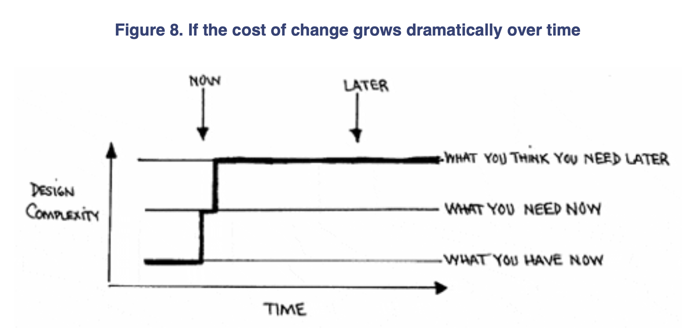
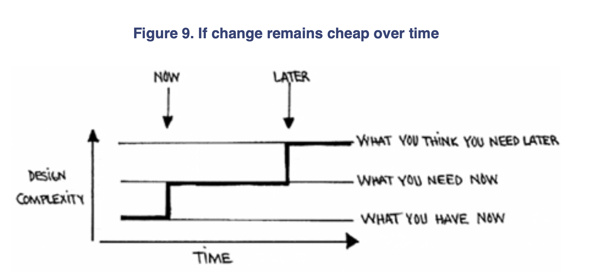
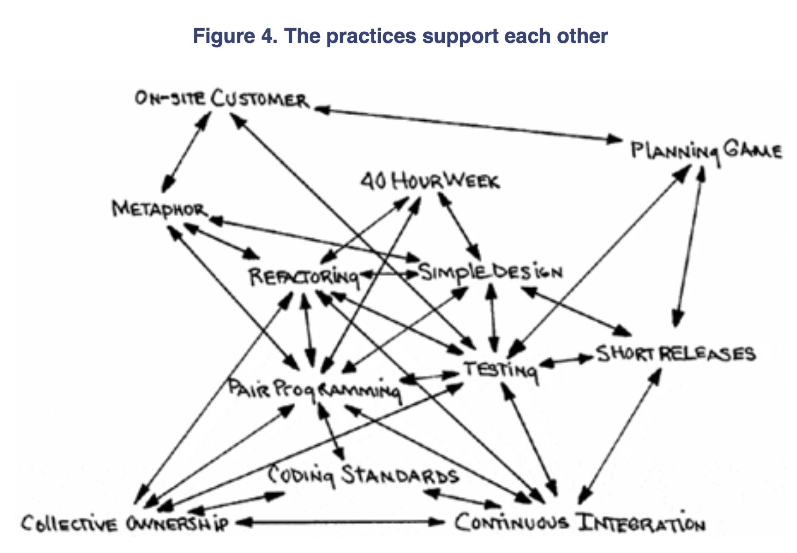

# Programación Extrema (PX) / Metodología ágil

---

<!-- backgroundColor: #d5ffea -->

## 1. ¿Qué es?

Una **metodología de trabajo** para equipos de desarrollo **medianos o pequeños** que operan en entornos en los que existen **nuevos requerimientos** o incluso cambios de rumbo rápidos y **constantes**. Es una ídea que lleva al "extremo" -al día a día del programador- estas técnicas :

---

### 1. Las iteraciones cortas

- La iteración es el acto de repetir un proceso, para generar una secuencia de resultados con el objetivo de acercarse a un propósito o resultado deseado.

- _Incremental change_: La estrategia de diseño se mueve poco a poco pero constantemente. Mediante **iteraciones cortas** el proyecto adquiere nuevas funcionalidades o modifica las ya existentes.

--- 

- De esta manera el sistema nunca está "del todo" diseñado. 

- Siempre habrá algo que sea necesario de cambiar, aunque haya partes que permanezcan inalterables durante mucho tiempo.

---

### 2. El diseño simple

- _Travel ligth_: En el diseño, se trabajará en **las funcionalidades imprescindibles** para que el sistema funcione pero no se avanzará en ideas que puedan surgir después o en otras posibles funcionalidades por dos razones:

	1. Quizá **no sea necesario** porque en el futuro puede haber un cambio de en los objetivos del proyecto.

	2. Si esperas a que necesites la funcionalidad es muy posible que encuentres una mejor manera de desarrollarla en el futuro.

---

- Está idea conecta con la simplicidad en el diseño (_asume simplicity_): se busca **el diseño más simple que pueda funcionar**, de manera que si no funciona, será fácil de cambiar.

- _Do the simplest thing that could possibly work_: la idea es empezar por un desarrollo básico que resuelva técnicamente los problemas más cruciales que el cliente demanda primero y subirlo a **producción** una vez lo tengamos.

---

- Es positivo empezar con una cantidad de recursos razonable que nos obligue a abordar lo fundamental y la idea más importante del proyecto _small inicial investment_. Recursos materiales en general (tiempo, dinero). 

- De manera que si el proyecto no va a ninguna parte en una fase temprana, no habremos perdido mucho.

---

---

### 3. La refactorización

- Los programadores **reescriben el código** sin alterar su funcionamiento con el objetivo de lograr una mayor flexibilidad, **simplicidad** y mejorar su lectura y así evitar errores y complicaciones en el mantenimiento.

---

### 4. La revisión de código (programación en parejas)

- El código se escribe en parejas en una misma máquina. Mientras **uno escribe**, el otro está pendiente de **la consistencia del código**. 

- El compañero piensa en si esa es la mejor manera de escribirlo desde el punto de vista del rendimiento o de evitar redundancias por ejemplo, y en si produce o no conflictos con otras partes del código.

---

- Bajo estres, los programadores suelen saltarse muchos de los otros puntos: los tests, las tareas de refactorización, la integración. Con un compañero en el mismo puesto de trabajo, las oportunidades de que esto suceda son menores.

---

### 5. La integración de código

- XP introduce una novedad con respecto a otros paradigmas: **las fase de desarrollo y de producción conviven** simultaneamente. 

- Se desecha por lo tanto la idea de fases de desarrollo muy largas que posterguen la de producción.

---

- Los programadores no trabajan en su parte de manera independiente y luego las juntan, sino que integran código y despliegan el sistema cada vez que una nueva tarea ha sido realizada.

- Es una tarea tan **cotidiana** como puede ser programar en parejas, iterar o refactorizar.

- No existe el código que permanezca fuera de la integración durante más de dos horas.

---

- Si dos personas tienen ideas diferentes sobre la apariencia del código en alguna de sus partes, **te enterarás rápido** gracias a que las iteraciones son cortas y simples.

- Si existe un _bug_ en el código o alguna incongruencia, también. Además, será **más fácil de subsanar**, ya que habrá sido creado recientemente.

---

### 6. El plan (_The Planning Game—Quickly_)

- Determinar **el objetivo** del siguiente lanzamiento en reuniones en las que se pongan en común las estimaciones técnicas y las prioridades del proyecto. ¿Qué es lo prioritario? ¿Cuánto vamos a tardar?

- El plan **no se realiza a largo plazo**, es decir, a medida que él avanza, **se va actualizando** en nuevas reuniones.

---

### 7. El diseño de la arquitectura (idea central o metáfora)

- La metáfora funciona como motor del proyecto. Es una **historia sencilla** o idea que describe el funcionamiento del proyecto.

- Comienza como una **historia simple y va evolucionando** y adquiriendo complejidad a medida que el proyecto crece a través de testeos y refactorizaciones.

---

### 8. El testeo de código (tests funcionales y unitarios)

- El proyecto no progresa hasta que **los test que fallen dejen de hacerlo** y devuelvan un resultado totalmente óptimo

- Los programadores escriben tests de unidad cuando suceden algunas de estas circunstancias:

---

- Se escriben tests de código cuándo tenemos una lógica muy sensible que puede romperse cuando añadamos una nueva funcionalidad por ejemplo

- Son muy útiles cuando tocamos un proyecto después de mucho tiempo y no nos acordamos de las funcionalidades que el código debía tener

---

- Los clientes escriben tests funcionales

- Los tests funcionales evaluan la funcionalidad de una de las partes del proyecto de cara al usuario y ponen a prueba los objetivos del proyecto.

- No es tan obligatorio que devuelvan un resultado 100% óptimo como en los tests unitarios, ya que un test funcional fallido no supone tanto riesgo para el código.

---

### 9. Incluir un cliente en la programación (_on-site costumer_)

- Con el objetivo de dar **feedback** sobre el progreso del proyecto en tiempo real.

---

### 10. Conocimiento colectivo

- Todos los programadores **implementan cambios en cualquier parte del código** buscando mejorarlo o modificarlo.

	- Esto hace que nadie sea imprescible ya que no hay parcelas o partes del código asignadas a nadie en concreto.

	- Y también implica que todo el equipo tenga un conocimiento básico del proyecto. Aquí es donde los tests cobran una mayor relevancia.
---

- Es importante que los programadores compartan _standarts_ de código. Es decir, que a la hora de programar se rijan por las **mismas normas de estilo**.

---

### 11. Horarios asumibles

- No trabajar nunca más de 40 horas semanales y si se sobrepasa este límite una semana, a la siguiente no se volvera a sobrepasar.

- En caso de que ocurra lo contrario, se considerará que **el proyecto tiene problemas graves** (de tiempo o de diseño).

---

### Interrelación entre técnicas

---

## 2. ¿Qué valores implica?

Para aplicar las técnicas que expone _Agile_ es necesario que el equipo tenga en cuenta los siguientes valores:

---

### 1. Comunicación

- Entre programadores, supervisor y cliente. 

- Debe ser **honesta**, si hay algún problema en el código que perjudica seríamente al proyecto se debe comunicar al programador

---

- La comunicación es constante e inmediata entre el equipo y el cliente.

- El proyecto apenas está un tiempo en desarrollo y se sube a producción para que el cliente pueda revisarlo y descubrir cosas con las que antes no contaba, comprobar que el funcionamiento es el correcto, etc.

---

### 2. Simplicidad

- Necesaria para realizar refactorizaciónes de código, iteraciones y testeos permanentes.

- Es mejor avanzar un poco en el proyecto empezando por lo imprescindible hoy que introducir **elementos complejos** que todavía **no son imprescindibles** y que puede que no tengan ninguna utilidad.

---

- Si llegamos al _deadline_ apurados tendremos asegurado que **lo esencial** del proyecto está implementado.

- _Agile_ **Se opone** a la cultura del desarrollo de **la reutilización**, que se esfuerza en planificar el futuro en lugar de resolver las tareas de hoy y confiar en ir añadiendo complejidad mañana.

---

- Las condiciones para que un proyecto sea simple son tres:

1. El sistema (código y tests) deben comunicar con **claridad** la manera con la que pretenden resolver las tareas

2. El sistema **no debe contener código redundante** ya que origina multitud de errores y dificulta el mantemiento

3. El sistema debe tener las menos clases posibles y los menores métodos posibles

---

### 3. Flexibilidad

- _Agile_ **no implica rigided** en sus normas. Por ello su aplicación depende del entorno de trabajo.

- En lugar de establecer un número fijo de tests o de refactorizaciones, es mejor hacernos la pregunta ¿Cuántos necesitamos para que nuestro proyecto progrese con éxito?

---

### 4. Corage o valentía

- Para arremeter cambios en situaciones difíciles.

- Se considera positivo incluso **desechar el código redundante** que se ha escrito durante un mal día o cambiar el diseño de un proyecto en aras de conseguir mayor simplicidad siempre y cuando haya habido comunicación con el equipo y se trabaje dentro de los tiempos estipulados.

---

## 3. Conclusión

- El objetivo en definitiva es avanzar poco a poco e ir cumplimentando las metas primordiales del proyecto y obtener feedback rápido del cliente al que acompañamos, esperando que éste pueda tener una respuesta adversa que implique un cambio de rumbo o una nueva iteración, pero que no nos cueste mucho seguir

---

- El programador actua como si estuviera manejando un volante siguiendo los requerimientos de un cliente al que también va ayudando a encontrar el rumbo.

- La clave de la metodología es bastante parecida a realizar una buena conducción: el objetivo no es seguir una línea recta o girar un volante, sino tener capacidad para maniobrar, cambiar de rumbo, visibilizar los obstáculos en el paso corto y actuar en consecuencia para evitarlos